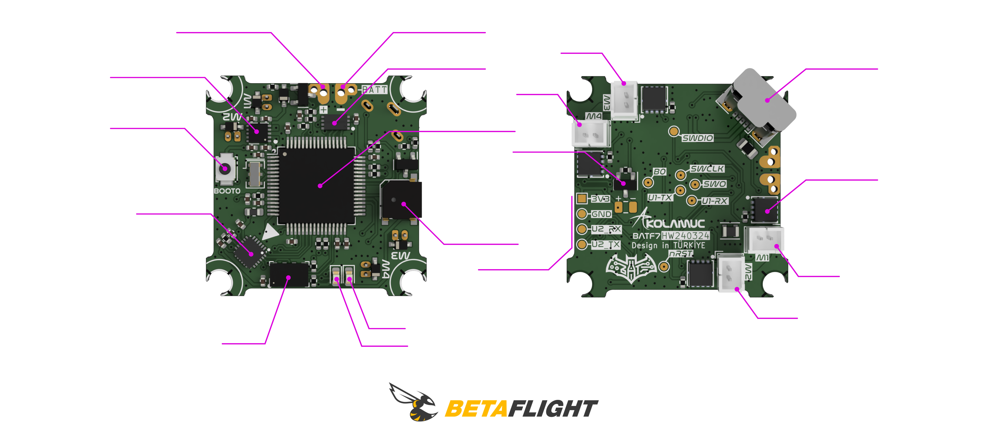

  <b>
   <h1>
      BATF7
   </h1>
   <h6>
     V1
   </h6>
  </b>

Key Features
* ARM Cortex-M7 core F7 216 MHz CPU
* Invensense MPU-6500 Six-Axis (Gyro + Accelerometer) low power consumption MEMS MotionTracking™ Device
* Blackbox logging via onboard dataflash chip
* Battery polarity reversed connection protection. The fc board remains perfect even if you plug the battery in wrong way.
* Fully programmable through Betaflight, using the onboard USB port, tune all the parameters, PID's, and rates to your perfect settings
* Designed to work with current Whoop Drone or Blade Inductrix setups
* The flight controller board comes pre-flashed with Betaflight firmware, and pre-soldered 55mm power cable pigtail with JST-PH 2.0 connector, AKA PowerWhoop connector.

Specifications
* CPU: `STM32F411CEU6`
* Six-Axis: `MPU6500`
* ESC: All FETs are rated at 35A maximum. Support 6x15mm/7x20mm/8x20mm/8.5x20mm etc motors.
* Size: 29mm x 29mm, fully compatible with the Inductrix quad frame and mounting pattern
* Firmware version: Betaflight BATF7 3.5.0
* Power Cable: 55mm, with JST-PH 2.0 connector, AKA PowerWhoop connector
* Weight: 4.2g 

